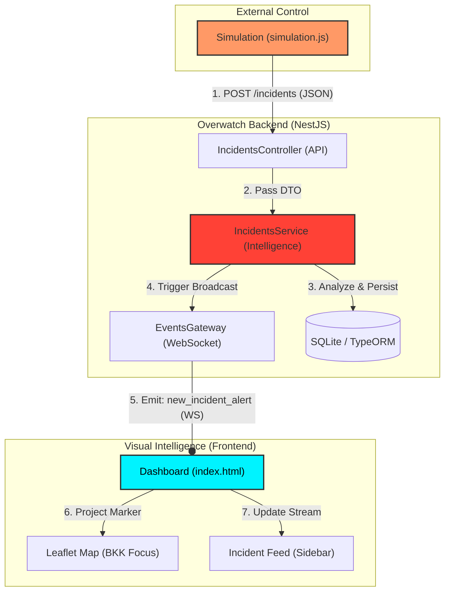

# Overwatch System Architecture

ระบบ Overwatch ถูกออกแบบมาเพื่อการตรวจจับและวิเคราะห์เหตุการณ์แบบจุดต่อจุด (Endpoint-to-Endpoint) โดยเน้นความเร็วระดับวินาที (Low Latency) และความแม่นยำทางภูมิศาสตร์

## 🏗️ System Components

## 📡 Data Flow Description (ภาษาไทย)

1.  **Simulation Flow**: ไฟล์ `simulation.js` ทำหน้าที่เป็นจุดกำเนิดข้อมูล โดยการส่งข้อมูลเหตุการณ์จำลองพร้อมพิกัดจริง (Lat/Long) ผ่านทาง HTTP POST ไปยัง API Endpoint ของระบบ
2.  **API Handling**: `IncidentsController` รับข้อมูล (DTO) และส่งต่อไปยัง `IncidentsService` ซึ่งเป็นสมองกลของระบบ
3.  **Intelligence Processing**: `IncidentsService` ทำการวิเคราะห์ Keyword เพื่อกำหนดระดับความรุนแรงและประเภทของเหตุการณ์ จากนั้นบันทึกลงฐานข้อมูล SQLite เพื่อเก็บเป็นประวัติ (Persistence)
4.  **Real-time Broadcast**: เมื่อวิเคราะห์เสร็จสิ้น Service จะสั่งให้ `EventsGateway` ทำการกระจายข้อมูลเหตุการณ์นั้นๆ ออกไปทางท่อสื่อสาร WebSocket (Port 3001) ทันที
5.  **Tactical Visualization**: หน้า Dashboard รับข้อมูลผ่าน Socket.io และนำพิกัดพุ่งไปปักหมุดบนแผนที่ของกรุงเทพฯ พร้อมอัปเดตรายการใน Sidebar แบบวินาทีต่อวินาทีโดยไม่ต้องรีเฟรชหน้าจอ

---
> **PROJECT STATUS**: OPERATIONAL | **PROTOCOL**: GENESIS
